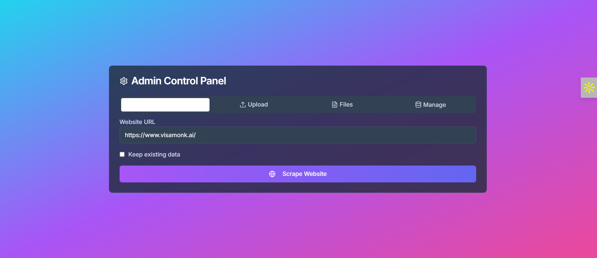

# VisaMonk University Chatbot 🎓🤖

The **VisaMonk University Chatbot** is an AI-powered web application designed to provide precise and accessible answers to university and visa-related queries. Originally developed as a Streamlit prototype for rapid iteration, it has evolved into a scalable, production-ready application built with Next.js, featuring a modern UI, secure APIs, and advanced functionalities. This project exemplifies a full-stack solution focused on user experience, security, and extensibility, making it ideal for enterprise deployment.

Hosted on GitHub Codespaces and accessible at [Live Demo](https://cuddly-space-couscous-x59xq6pg5v4qhvqq7-3000.app.github.dev), this chatbot impresses with its robust functionality and professional polish.

---

## Table of Contents 📚

- [Features](#features)
- [Tech Stack](#tech-stack)
- [Setup Instructions](#setup-instructions)
- [Workflow](#workflow)
- [Streamlit vs. Next.js Comparison](#streamlit-vs-nextjs-comparison)
- [Future Scope](#future-scope)
- [Screenshots](#screenshots)
- [Contributing](#contributing)
- [License](#license)

---

## Features ✨

- **Chat Interface:**  
  Ask about university programs, tuition fees, and visa requirements. Powered by Google Gemini API for natural language processing, FAISS for vector search, and SQLite for structured data queries.

- **Admin Panel:**  
  JWT-secured interface allowing admins to:  
  - Upload files (CSV, XLSX, PDF) for data ingestion.  
  - Delete files from the system.  
  - Reindex data for the chatbot’s knowledge base.  
  - Clear the database and vectorstore.  
  - List uploaded files.

- **Text-to-Speech (TTS):**  
  Converts text responses to audio for accessibility, supporting multiple languages.

- **Multilingual Support:**  
  Handles queries in various languages using deep_translator, translating to English for processing and back to the user’s language.

- **API Documentation:**  
  Interactive Swagger UI at `/api-docs` for testing all endpoints with JWT authentication.

- **Static Pages:**  
  Informative pages (`/about`, `/solutions`, `/contact`) for a complete user experience.

- **Responsive UI:**  
  Built with Tailwind CSS and Shadcn UI for a modern, mobile-friendly design.

---

## Tech Stack 🛠️

- **Frontend:** Next.js 14 (App Router), React 18, Tailwind CSS, Shadcn UI, swagger-ui-react, sonner (toast notifications).  
- **Backend:** Python 3 (`chat_processor.py`, `data_indexer.py`, `file_processor.py`), SQLite, FAISS, google-generativeai, deep_translator, tavily.  
- **APIs:** Next.js API routes (`/api/auth/login`, `/api/chat`, `/api/tts`, `/api/admin/*`).  
- **Authentication:** JSON Web Tokens (jsonwebtoken) for secure admin access.  
- **Other:** js-yaml for Swagger UI, multer for file uploads, child_process for Python integration.

---

## Setup Instructions 🚀

```bash
# Clone the Repository
git clone https://github.com/Sumitkumar005/query2-chatbot.git
cd query2-chatbot

# Install Node.js Dependencies
npm install

# Install Python Dependencies
pip install -r requirements.txt
```

**Expected `requirements.txt` includes:**

- google-generativeai  
- faiss-cpu  
- deep_translator  
- tavily-python  
- pandas  
- sentence-transformers  
- python-dotenv

**Set Up Environment Variables:** Create `.env.local` with:

```
GOOGLE_API_KEY=your_google_api_key
TAVILY_API_KEY=your_tavily_api_key
JWT_SECRET=your_jwt_secret
```

**Run the Application:**

```bash
npm run dev
```

**Access the App:**

- Local: [http://localhost:3000](http://localhost:3000)  
- Codespaces: [Live Demo](https://cuddly-space-couscous-x59xq6pg5v4qhvqq7-3000.app.github.dev)

**Test APIs:**

- Visit `/api-docs` for Swagger UI.  
- Log in with `admin@visamonk.ai` / `admin123` to test admin endpoints.

---

## Workflow 🔄

1. **User Query:**  
   Users enter queries on `/chat` (e.g., “What’s the tuition at MIT?”). The frontend sends a POST request to `/api/chat` with `{ message, language, history }`.

2. **Query Processing:**  
   `/api/chat` spawns `chat_processor.py` via `child_process`.  
   - Structured queries: Gemini API generates SQL for `chatbot.db`.  
   - Unstructured queries: FAISS retrieves relevant text chunks; Gemini generates a response.  
   Multilingual queries are translated to English with `deep_translator`, processed, then translated back.

3. **Response Delivery:**  
   The Python script returns JSON with the response and follow-up questions. The frontend displays the response and offers TTS playback via `/api/tts`.

4. **Admin Operations:**  
   Admins log in via `/api/auth/login` to get a JWT.  
   `/api/admin/upload` processes files with `file_processor.py`, updating `chatbot.db` and `vectorstore/index.faiss`.  
   Other admin endpoints manage data (delete files, reindex, clear database).

5. **API Testing:**  
   Swagger UI at `/api-docs` loads `public/openapi.yaml` and supports JWT authentication for testing.

---

## Streamlit vs. Next.js Comparison ⚔️

| Aspect               | Streamlit                                   | Next.js                                      | Why Next.js Wins                              |
|----------------------|--------------------------------------------|----------------------------------------------|-----------------------------------------------|
| UI/UX                | Basic, auto-generated UI                    | Modern, responsive UI with Tailwind & Shadcn UI | Customizable, mobile-friendly, professional   |
| Authentication       | No built-in auth                            | JWT-based auth with secure middleware        | Secure, seamless admin access                  |
| APIs                 | No native API support                       | Built-in API routes                           | Simplified backend development                 |
| API Documentation    | No built-in docs                           | Interactive Swagger UI                        | Easy API testing and demos                      |
| Scalability          | Limited, single-threaded                    | Server-side rendering, scalable with Vercel | Handles production-scale traffic               |
| File Uploads         | Basic forms                                | Robust uploads with multer and Python        | Secure, scalable file handling                  |
| Multilingual Support | Clunky integration                         | Seamless integration                          | Consistent multilingual experience             |
| TTS Integration      | File download                              | In-browser audio playback                      | Better user experience                           |
| Static Pages         | Limited, single-page                        | Dedicated pages                               | Full website experience                         |
| Dependency Management| Python-only                               | Node.js + Python                              | Supports richer features                        |
| Deployment           | Streamlit Cloud or manual                   | Vercel or Node.js server                       | Simplified CI/CD deployment                      |
| Performance          | Slower for complex apps                     | Optimized SSR and static generation           | Faster page loads                               |
| Error Handling       | Basic try-except                           | Robust error handling with toast notifications| Cleaner user feedback                           |

**Why the Switch?**  
Streamlit was perfect for quick prototyping but lacked flexibility, security, and scalability. Next.js offers a modern UI, built-in APIs, JWT auth, and Swagger UI, making the app enterprise-ready and demo-friendly.

---

## Future Scope 🚀

- **Performance:** Redis caching, optimized FAISS indexing.  
- **Database:** Migrate to PostgreSQL, add schema migration tools.  
- **Real-Time Features:** WebSockets for live chat and admin notifications.  
- **Testing:** Unit tests with Jest and Pytest, end-to-end tests with Cypress.  
- **Security:** Rate limiting, input sanitization.  
- **UI/UX:** Animations with Framer Motion, dark mode support.  
- **Deployment:** Docker, Kubernetes, CDN for static files.  
- **AI Enhancements:** Fine-tune Gemini API, user feedback loop.  
- **Accessibility:** ARIA labels, keyboard navigation, expanded TTS languages.

---

## Screenshots 🖼️

### Admin Panel

  
  
  

### Chat Interface

  
  

### Homepage

  
  
  

### Swagger API Testing

  
  
  

---

## Contributing 🤝

Contributions are welcome! To contribute:

1. Fork the repository.  
2. Create a branch (`git checkout -b feature/your-feature`).  
3. Commit your changes (`git commit -m "Add your feature"`).  
4. Push to the branch (`git push origin feature/your-feature`).  
5. Open a pull request.

Please follow the Code of Conduct and ensure tests pass.

---

## License 📄

This project is licensed under the MIT License. See the [LICENSE](LICENSE) file for details.

---

Built with 💻 and ☕ by Sumitkumar005
